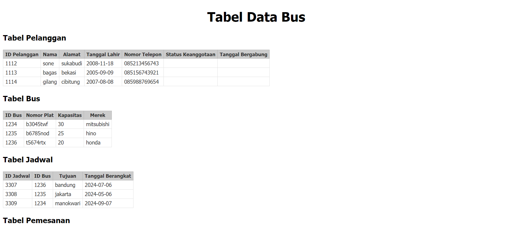

# Tugas pertemuan 12

Koneksi Database Mysql Ke PHP
Judul "database uts"
 
ada 5 tabel  
1. Tabel Pelanggan  
2. Tabel bus  
3. Tabel jadwal  
4. Tabel Pemesanan  
5.  Tabel detail_pemesanan  

# Desain database

            
# Screenshoot tabel

